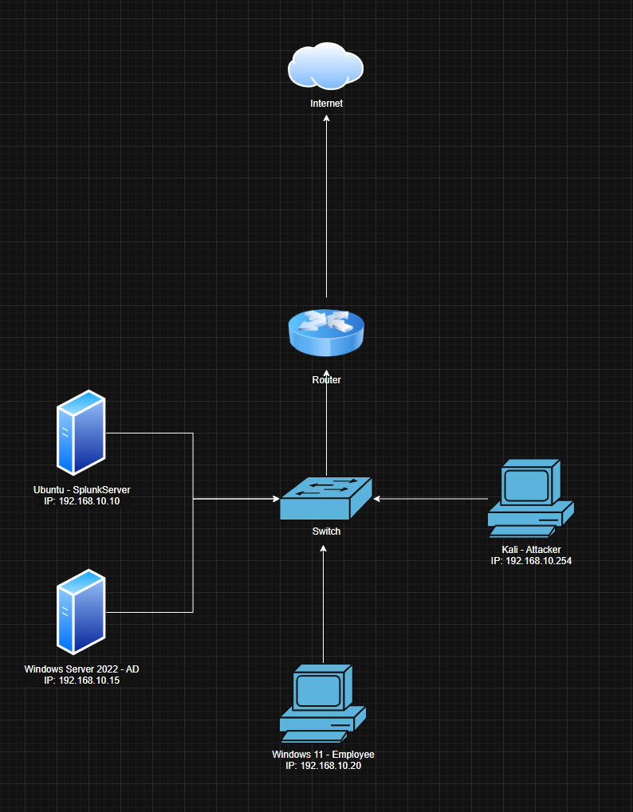
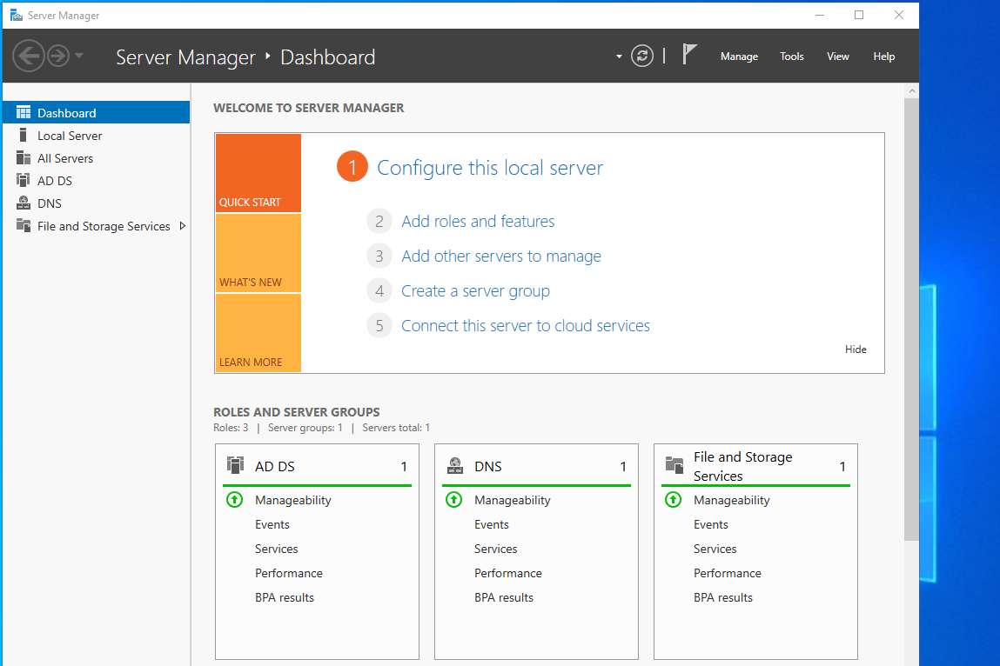

# AD-SPLUNK

A hands-on cybersecurity laboratory project focused on deploying, configuring, and testing a Splunk SIEM environment integrated with Active Directory using VirtualBox.

## Project Overview

The objective of this project was to gain practical experience with Security Information and Event Management (SIEM) technologies by deploying a centralized Splunk monitoring environment, implementing an Active Directory Domain Controller (AD DC), collecting Windows security telemetry, and analyzing security events through simulated attacks.

The laboratory environment was built to simulate a small enterprise network by combining Active Directory authentication, endpoint monitoring, centralized log collection, and attack simulation.

The lab consists of:

- Ubuntu Server running Splunk Enterprise
- Windows Server 2022 running Active Directory Domain Services (AD DS), Sysmon, and Splunk Universal Forwarder
- Windows 11 employee workstation joined to the Active Directory domain running Sysmon and Splunk Universal Forwarder
- Kali Linux used for attack simulation

## Architecture

The laboratory network architecture is shown below:



## Environment

| Machine | Operating System | Purpose |
|----------|----------------|----------|
| Splunk Server | Ubuntu Server | Splunk Enterprise SIEM Platform |
| Domain Controller | Windows Server 2022 | Active Directory Domain Services, Sysmon, Splunk Universal Forwarder |
| Employee Endpoint | Windows 11 | Domain Client, Sysmon, Splunk Universal Forwarder |
| Attacker | Kali Linux | Attack Simulation |

**Virtualization Platform:** Oracle VirtualBox

# Installation

## Splunk Server

Splunk Enterprise was installed on Ubuntu Server and configured as the centralized SIEM platform.

The server was used for:

- Receiving endpoint logs
- Searching and analyzing security events
- Creating Splunk searches
- Monitoring authentication activity
- Investigating collected event data

## Windows Endpoint Monitoring

Windows systems were configured with:

- Splunk Universal Forwarder
- Sysmon
- Windows Event Log Collection

Sysmon provided additional endpoint telemetry including:

- Process creation events
- Network connections
- System activity
- Security-related events

The collected telemetry was forwarded to Splunk for analysis.

## Active Directory Deployment

Windows Server 2022 was configured as an Active Directory Domain Controller.

The Windows 11 workstation was joined to the domain to simulate a realistic enterprise environment.

Active Directory enabled monitoring of:

- Domain authentication events
- User activity
- Failed login attempts
- Successful logins
- Endpoint security events

# Security Monitoring and Analysis

## RDP Brute Force Detection

A simulated RDP brute-force attack was performed from Kali Linux against the Windows 11 employee workstation.

The purpose of the test was to evaluate how Windows authentication events are collected and analyzed in Splunk.

Splunk was used to analyze:

- Failed authentication attempts
- Source IP addresses
- Target usernames
- Windows Security Event Logs

Relevant Windows Event IDs:

```
4625 - Failed Logon
4624 - Successful Logon
```

The objective was to understand how suspicious authentication activity can be identified using centralized log analysis.

## Sysmon Event Monitoring

Sysmon telemetry was collected through Splunk Universal Forwarders.

The monitored activity included:

- Process execution
- Network connections
- System activity
- Security-related events

This provided additional visibility into endpoint activity compared to standard Windows event logs.

# Testing

## RDP Brute Force Simulation

A brute-force attack was simulated from Kali Linux against the Windows 11 employee endpoint.

Expected outcome:

- Multiple failed login events generated
- Windows Security logs forwarded to Splunk
- Suspicious authentication activity identified
- Attack source visible through Splunk searches

## Active Directory Authentication Testing

Domain authentication was tested by:

- Logging in with domain users
- Generating failed login attempts
- Monitoring authentication events inside Splunk

Expected outcome:

- Authentication events collected successfully
- User activity visible in Splunk
- Security events available for investigation

# Results

## Splunk Log Collection

Splunk successfully collected security telemetry from Windows endpoints through Universal Forwarders.

Collected data included:

- Windows Security Events
- Sysmon Events
- Authentication logs
- Endpoint activity

## RDP Attack Analysis

The simulated brute-force attack generated multiple failed authentication events.

The activity was analyzed in Splunk by reviewing:

- Failed login attempts
- Source IP information
- Target usernames
- Authentication patterns

This demonstrated how SIEM solutions can be used to collect, search, and analyze security-related events in a controlled laboratory environment.

# Skills Demonstrated

- Splunk Administration
- SIEM Deployment
- Splunk Universal Forwarder Configuration
- Active Directory Administration
- Windows Server Administration
- Windows Security Monitoring
- Sysmon Configuration
- Log Collection and Analysis
- Authentication Event Analysis
- RDP Attack Simulation
- Linux Administration
- VirtualBox Lab Development
- Cybersecurity Laboratory Design

# Lessons Learned

This project provided practical experience in building a small enterprise-style security monitoring environment.

The main learning areas were understanding how endpoint logs are collected, how Active Directory authentication works, and how SIEM tools can be used to analyze security events.

Building the Active Directory environment and connecting multiple endpoints demonstrated the importance of centralized logging and visibility in an organization.

The project also improved understanding of how attacks generate detectable events and how security monitoring tools can be used to investigate suspicious activity.

# Future Improvements

Potential enhancements include:

- Splunk Enterprise Security deployment
- MITRE ATT&CK technique mapping
- Custom Splunk searches and alerts
- Sigma rule integration
- PowerShell activity monitoring
- Malware execution monitoring
- Additional domain endpoints
- Threat intelligence integration
- Automated alerting and response workflows
- Dashboard customization

# Screenshots

- 
- 
- 
- 
- 

# Author

**Martin Glas**

Cybersecurity Laboratory Project (2026)
